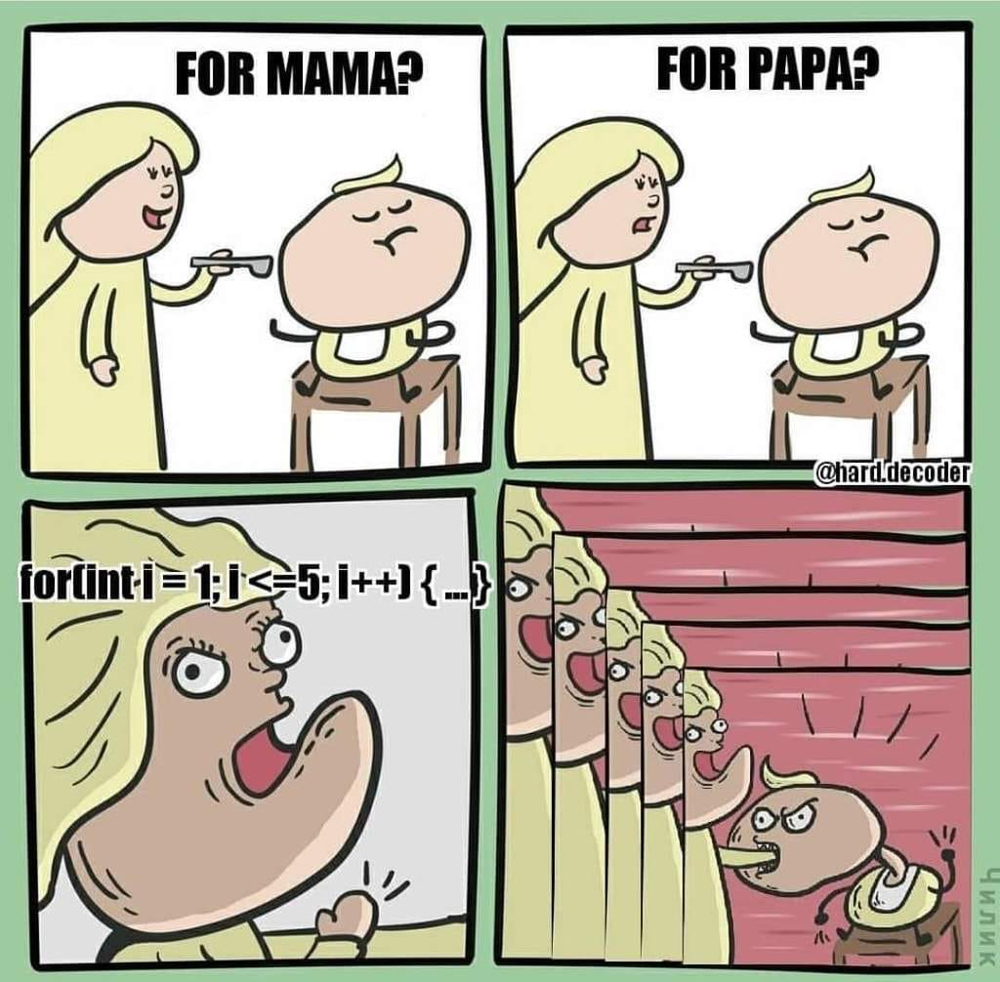
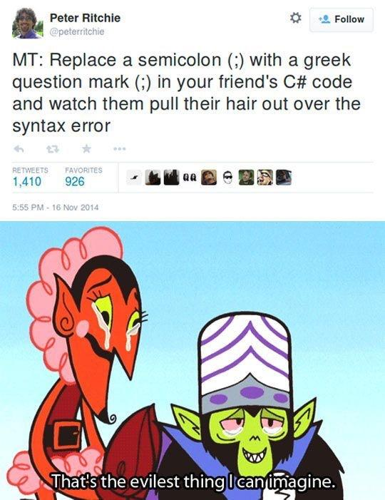

# Podstawy programowania w C++ - instrukcja if, pętle


## Instrukcja warunkowa IF
Możesz użyć instrukcji `if`, aby wykonać fragment kodu, jeśli spełniony jest określony warunek. 
Jeśli wyrażenie ma wartość `True`, wykonywane są pewne instrukcje. W przeciwnym razie są one pomijane. Instrukcja `if`
wygląda następująco:
```C++
if (wyrażenie warunkowe){
  instrukcje
}
```
W C++ wyrażenie zapisujemy w nawiasach okrągłych. Instrukcje które mają się wykonać zapisywane są miedzy nawiasami klamrowymi. Dla czytelności kodu instrukcje pisane są z wcięciem. 
Przykład:
```C++
if (15 > 10){
  cout << "Warunek prawdziwy." << endl;
  cout << "15 jest wieksze od 10" << endl;
}
cout << "Koniec programu" << endl;
```

Jeżeli używamy tylko jednej instrukcji, to nie musimy używać nawiasów klamrowych:
```C++
if (15 > 10)
  cout << "15 jest wieksze od 10" << endl;

cout << "Koniec programu" << endl;
```

Aby wykonać bardziej złożone warunki, instrukcje mogą być zagnieżdżone, jedna w drugiej. Oznacza to, że wewnętrzne instrukcje `if` są częścią instrukcji zewnętrznej. Jest to jeden ze sposobów sprawdzenia, czy spełnione są warunki wielokrotne.
Przykład:
```c++
if (num >= 5){
  cout << "Liczba wieksza od 5" << endl;
  if (num <= 45){
    cout << "Liczba z przedziału [5, 45]" << endl;
  }
}
```
Instrukcja `else` wykonuje instrukcję `if` i zawiera kod, który jest wywoływany, gdy instrukcja `if` zwraca wartość `False`. Podobnie jak w przypadku instrukcji `if`, używa się nawiasów klamrowych.
Przykład:
```C++
int x = 4;
if (x == 5){
  cout << "Tak" << endl;
}
else{
  cout << "Nie" << endl;
}
```
Instrukcja `else if` jest rozwinięciem instrukcji `else`, w przypadku gdy chcemy sprawdzić kolejne warunki, 
np. gdy chcemy sprawdzić kolejne dzielniki liczby. Seria instrukcji `if`, `else if` może mieć końcowy blok 
`else`, który jest wywoływany, jeśli żadne z wyrażeń `if` lub `else if` nie jest prawdziwe.
Przykład:
```C++
int num = 12;

if (num == 5) {
    cout << "Numerem jest 5" << endl;
}
else if (num == 10) {
    cout << "Numerem jest 10" << endl;
}
else if (num == 15) {
    cout << "Numerem jest 15" << endl;
}
else {
    cout << "Numerem nie jest 5, 10 ani 15" << endl;
}

```
### Operatory logiczne
Służą do tworzenia bardziej skomplikowanych warunków dla instrukcji, które opierają się na więcej niż jednym 
warunku. Operatorami logicznymi w C++ są:
- `&&` - AND (koniunkcja) 
- `||` - OR (lub)
- `!=` - NOT (zaprzeczenie)

Przykład wyrażenia wykorzystującego koniunkcję:
```c++
float punkty = 4;

if(punkty > 3 && punkty < 5 ) {
    cout << "Ocena ze sprawdzianu: 4" << endl;
}
else if (punkty >= 5 && punkty < 8) {
    cout << "Ocena ze sprawdzianu: 5" << endl;
}

```

### Zadanie 1
Uzupełnij tabelę dla działań alternatywy i koniunkcji z logiki matematycznej:

| a | b | !a | !b | a && b | a \|\| b |
|---|---|----|----|--------|----------|
| 1 | 0 |||||
| 0 | 1 |||||
| 1 | 1 |||||
| 0 | 0 ||||

### Zadanie 2

Uzupełnij instrukcje w pliku `if.cpp`.


## Pętle

### Pętla while
Instrukcja `if` jest uruchamiana jednokrotnie, jeśli jej warunek jest prawdziwy, a nigdy, jeśli oceniany jest jako fałszywy. Instrukcja `while` jest podobna, z tym wyjątkiem, że może być uruchamiana więcej niż raz. Instrukcje wewnątrz niej są wielokrotnie wykonywane, o ile warunek jest prawdziwy. Po przejściu do wartości False wykonywana jest następna sekcja kodu. Poniżej znajduje się pętla `while` zawierająca zmienną, która liczy od 1 do 5, w którym to momencie pętla kończy się.
```c++
int i = 1;
while (i <= 5) {
    cout << i << endl;
    i++;
}
cout << "Koniec!" << endl;

```
Generalnie przyjętą konwencją jest używanie liter `i`, `j`, `k` itd. jako liczników pętli.

Nieskończona pętla jest specjalnym rodzajem pętli while; nigdy się nie kończy. Jej stan pozostaje zawsze prawdziwy.
Nieskończoną pętlę można także uzyskać, gdy niepoprawnie sformułujemy warunek zakończenia pętli.
Przykład:
```c++
while (true) {
    cout << "operacje w pętli" << endl;
}

```

#### Nieskończona pętla
Nieskończoną pętlę można także uzyskać, gdy niepoprawnie sformułujemy warunek zakończenia pętli.

```c++
int i = 1;
while (i < 5) {
    cout << "nieskonczona petla" << endl;
}
```
Czego brakuje w powyższym przykładzie, żeby wyjść z pętli?

Aby przedwcześnie zakończyć pętlę, można użyć instrukcji break. Po napotkaniu wewnątrz pętli instrukcja break powoduje natychmiastowe zakończenie pętli.
Przykład:
```c++
int i = 0;

while (true) {
    cout << i << endl;
    i++;
    if (i >= 5) {
        cout << "Przerwanie" << endl;
        break;
    }
}
cout << "Koniec" << endl;

```
Kolejną instrukcją, która może być używana w pętlach, jest
continue. W przeciwieństwie do break, continue przeskakuje
z powrotem na początek pętli, zamiast ją zatrzymywać. 
Przykład:
```c++
int i = 0;
while (i < 5) {
    i++;
    if (i == 2) {
        continue;
    }

    cout << i << endl;
  
cout << "Koniec" << endl;

```

W powyższym przykładzie zostaną wypisane liczby od 1 do 5 z pominięciem 2.

### Pętla do while


Pętla `do while` jest bardzo podobna do pętli `while`, z jedną istotną różnicą:
warunek sprawdzany jest dopiero po wykonaniu instrukcji w pętli.
Oznacza to, że ciało pętli wykona się zawsze co najmniej jeden raz, nawet jeśli warunek od początku jest fałszywy.


```c++
int i = 6;

do {
    cout << i << endl;
    i++;
} while (i <= 5);

cout << "Koniec!" << endl;
```

Przykładowym użyciem może być program, który pyta użytkownika o liczbę dopóki ten nie poda liczby dodatniej:
```c++
int liczba;

do {
    cout << "Podaj liczbe dodatnia: ";
    cin >> liczba;
} while (liczba <= 0);

cout << "Podano poprawna liczbe" << endl;
```
### Pętla for
Pętla `for` jest używana w przypadkach, gdy wiemy ile razy mają się wykonać instrukcje zawarte w pętli.


Przykład:
```c++
for (instrukcja 1; instrukcja 2; instrukcja 3) {
  // jakis madry kod
}
```
Instrukcja 1 jest wykonywana jednorazowo przed rozpoczęciem wykonywania bloku kodu.

Instrukcja 2 określa warunek wykonywania bloku kodu.

Instrukcja 3 jest wykonywana za każdym razem po wykonaniu bloku kodu.

Przykład:
```c++
for (int i = 0; i <= 10; i = i + 2) {
  cout << i << endl;
}

```

## Zadania do wykonania 
1. Przepisz przykład zagnieżdżonego if-a z początku instrukcji jako jeden `if`.
2. Korzystając z pętli `for` oblicz sumę liczb naturalnych od 8 do 80.
3. Napisz program który obliczy sumę liczb od 1 do 10 z następującymi warunkami:
    - Pominie liczbę 4,
    - Liczby 5, 7, 9 zostaną dodane podwójnie
    - Liczba 10 zostanie dodana normalnie, a oprócz tego suma zostanie podwojona.
4. Napisz prosty kalkulator posiadający menu wyboru 
działania i wykonującego działania dla dwóch liczb (dodawanie, odejmowanie, mnożenie, dzielenie). W tym celu pomocne będą:
    - zmienne dla liczb a, b
    - zmienna dla działania
    - wpisanie znaku `!` będzie kończyc program

